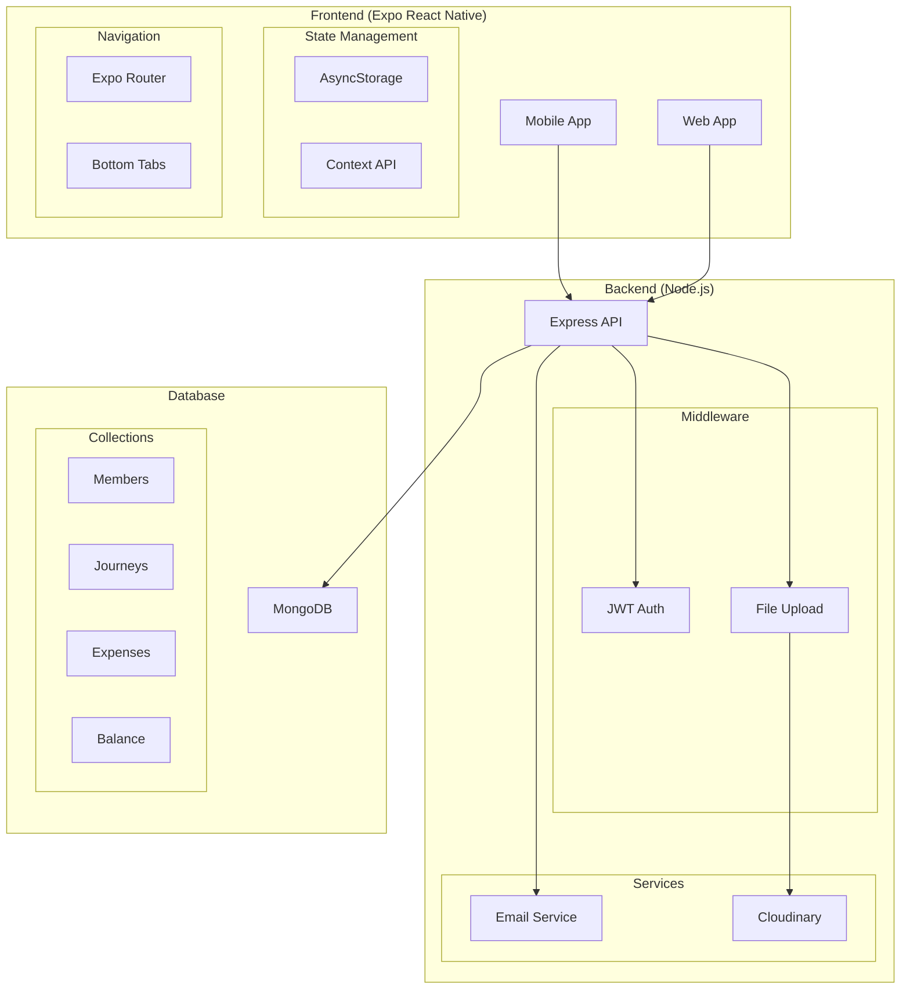
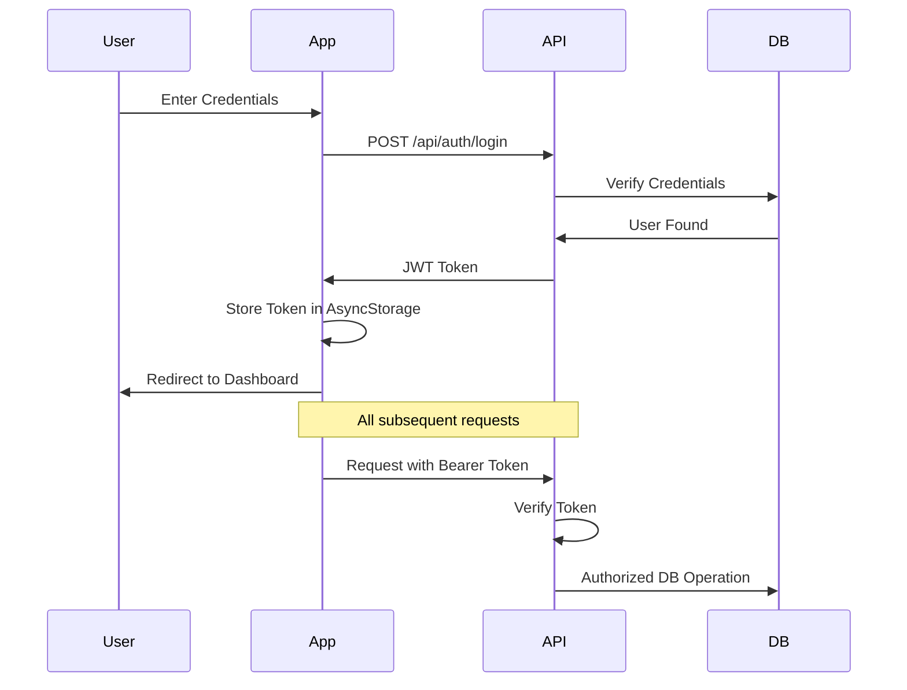
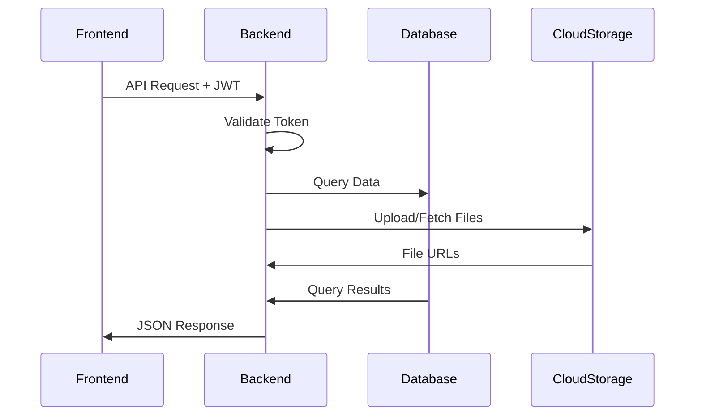

# System Architecture

## High-Level Architecture

## Technology Stack

| Component | Technology | Version | Purpose | Alternative Options |
|-----------|------------|---------|---------|-------------------|
| **Frontend** |
| Mobile/Web Framework | Expo | 53.0.23 | Cross-platform development | React Native CLI, Flutter |
| Navigation | Expo Router | 7.x | Type-safe routing | React Navigation |
| State Management | Context API + AsyncStorage | Built-in | Local state & persistence | Redux, MobX |
| UI Components | Native Base | Latest | UI component library | React Native Paper |
| **Backend** |
| Server | Node.js + Express | 18.x + 5.1.0 | API server | NestJS, Fastify |
| Authentication | JWT | 9.0.2 | Stateless authentication | Session-based, OAuth |
| File Storage | Cloudinary | Latest | Media file storage | AWS S3, Firebase Storage |
| Email | Nodemailer | 7.0.6 | Email notifications | SendGrid, AWS SES |
| **Database** |
| Primary Database | MongoDB | 8.18.0 | Data persistence | PostgreSQL, MySQL |
| ODM | Mongoose | 8.x | Database modeling | Prisma, TypeORM |
| **DevOps** |
| Containerization | Docker | Latest | Deployment packaging | Kubernetes |
| Process Manager | PM2 | Latest | Production process management | Forever, Nodemon |

## System Components

### Frontend Architecture

The frontend is built as an Expo bare workflow application, providing:
- Native platform capabilities with Expo's development features
- Type safety with TypeScript
- File-based routing with Expo Router
- Role-based UI components (Admin/User)
- Offline data persistence with AsyncStorage
- JWT token management for authentication

### Backend Architecture

The backend follows a modular MVC pattern:
- Routes → Controllers → Services → Models flow
- Middleware-based authentication and authorization
- File upload handling with Cloudinary integration
- Email service integration with Nodemailer
- Error handling middleware for consistent responses

### Database Design

MongoDB collections with Mongoose schemas:
- Members (users, admins)
- Journeys (travel records)
- Expenses (cost tracking)
- Balance (financial records)

## Authentication Flow

## Data Flow

## Security Architecture

1. **Authentication**
   - JWT-based token authentication
   - Role-based access control (user, admin, superadmin)
   - Token expiration and refresh mechanism

2. **Data Security**
   - HTTPS for all API communication
   - Password hashing with bcryptjs
   - Environment variable-based secrets
   - File upload validation and sanitization

3. **API Security**
   - CORS configuration
   - Rate limiting (recommended)
   - Input validation middleware
   - Error handling without sensitive data exposure

## Scalability Considerations

1. **Frontend**
   - Code splitting for optimal bundle size
   - Asset preloading strategies
   - Offline-first capabilities
   - Performance monitoring integration

2. **Backend**
   - Horizontal scaling with Docker
   - Load balancer support
   - MongoDB replica sets
   - Caching strategies (recommended)

3. **Infrastructure**
   - Container orchestration readiness
   - CI/CD pipeline support
   - Monitoring and logging infrastructure
   - Backup and disaster recovery procedures

## Design Decisions

1. **Expo Bare Workflow**
   - Provides native customization capability
   - Maintains Expo development features
   - Enables custom native modules

2. **MongoDB**
   - Flexible schema for rapid development
   - Excellent scalability characteristics
   - Native support for JSON data

3. **JWT Authentication**
   - Stateless authentication for scalability
   - Reduced database queries
   - Simple mobile client implementation

4. **Cloudinary Integration**
   - Managed file storage and optimization
   - CDN capabilities
   - Image transformation features