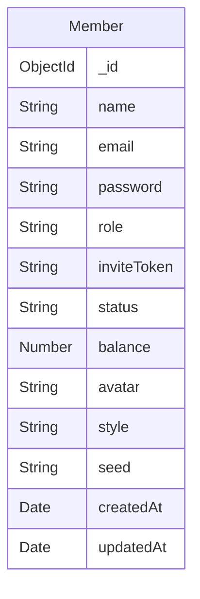
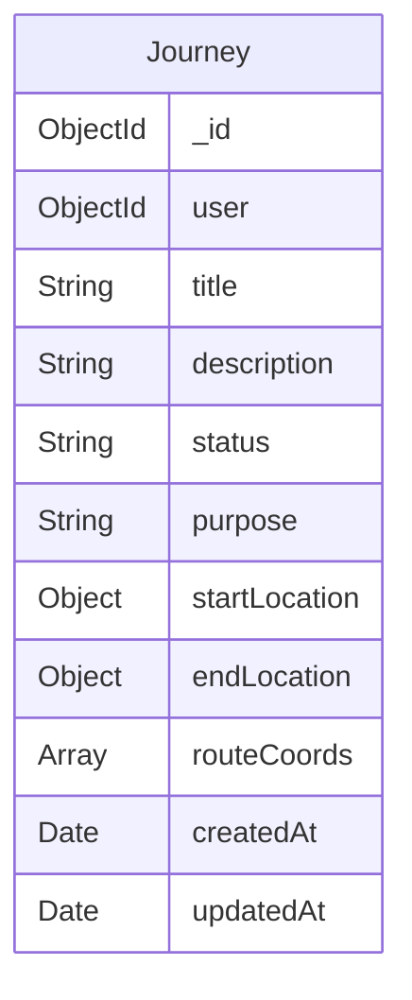
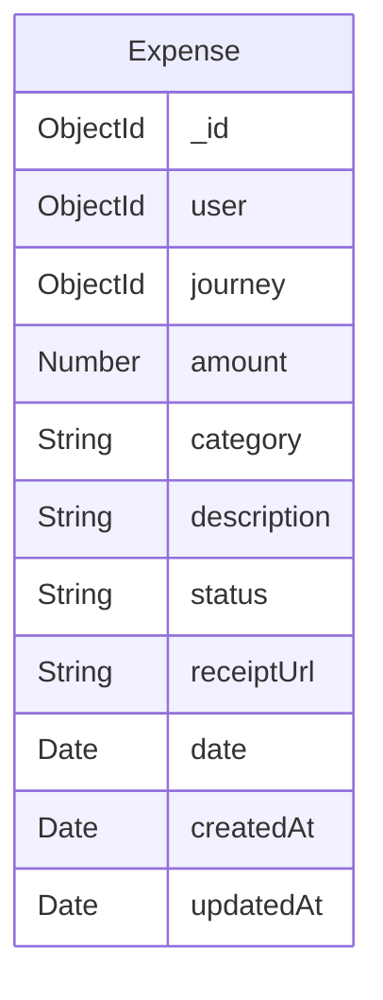
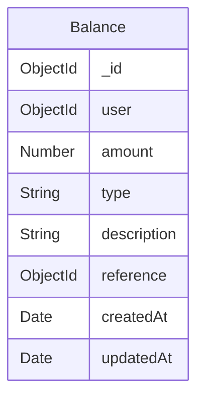

# Database Documentation

## Overview

The L&T Sales Tracker application uses MongoDB (version 8.x) as its primary database. The database is designed to support user management, journey tracking, expense management, and financial record keeping.

## Connection Architecture

### Development
```javascript
mongodb://localhost:27017/lt-sales-tracker
```

### Production
```javascript
mongodb+srv://<username>:<password>@<cluster>.mongodb.net/lt-sales-tracker?retryWrites=true&w=majority
```

### Connection Configuration
```javascript
// backend/config/db.js
{
  useNewUrlParser: true,
  useUnifiedTopology: true,
  maxPoolSize: 10,
  serverSelectionTimeoutMS: 5000,
  socketTimeoutMS: 45000
}
```

## Database Schema

### Members Collection



**Fields Description:**
| Field | Type | Required | Default | Description |
|-------|------|----------|----------|-------------|
| name | String | No | null | User's full name |
| email | String | Yes | - | Unique email address (lowercase) |
| password | String | Yes | - | Hashed password |
| role | String | Yes | - | Either "admin" or "user" |
| inviteToken | String | No | null | Token for registration |
| status | String | No | "pending" | "pending", "active", or "inactive" |
| balance | Number | No | 0 | User's current balance |
| avatar | String | No | null | Profile picture URL |
| style | String | No | null | UI preference |
| seed | String | No | null | Avatar generation seed |

**Indexes:**
```javascript
{ email: 1 } // unique
{ inviteToken: 1 } // sparse
```

### Journeys Collection



**Fields Description:**
| Field | Type | Required | Description |
|-------|------|----------|-------------|
| user | ObjectId | Yes | Reference to Member |
| title | String | No | Journey title |
| description | String | No | Journey details |
| status | String | No | Journey status |
| purpose | String | No | Journey purpose |
| startLocation | Object | No | Starting coordinates |
| endLocation | Object | No | Ending coordinates |
| routeCoords | Array | No | Journey route points |

**Location Object Structure:**
```javascript
{
  latitude: Number,
  longitude: Number
}
```

**Indexes:**
```javascript
{ user: 1 }
{ status: 1 }
{ createdAt: 1 }
```

### Expenses Collection



**Fields Description:**
| Field | Type | Required | Description |
|-------|------|----------|-------------|
| user | ObjectId | Yes | Reference to Member |
| journey | ObjectId | No | Related journey |
| amount | Number | Yes | Expense amount |
| category | String | Yes | Expense category |
| description | String | No | Details |
| status | String | Yes | Approval status |
| receiptUrl | String | No | Receipt image URL |
| date | Date | Yes | Expense date |

**Indexes:**
```javascript
{ user: 1 }
{ journey: 1 }
{ status: 1 }
{ date: 1 }
```

### Balance Collection



**Fields Description:**
| Field | Type | Required | Description |
|-------|------|----------|-------------|
| user | ObjectId | Yes | Reference to Member |
| amount | Number | Yes | Transaction amount |
| type | String | Yes | "credit" or "debit" |
| description | String | No | Transaction details |
| reference | ObjectId | No | Related expense/journey |

**Indexes:**
```javascript
{ user: 1 }
{ type: 1 }
{ createdAt: 1 }
```

## Relationships

1. **Member → Journeys**
   - One-to-Many
   - Member.\_id → Journey.user

2. **Member → Expenses**
   - One-to-Many
   - Member.\_id → Expense.user

3. **Journey → Expenses**
   - One-to-Many
   - Journey.\_id → Expense.journey

4. **Member → Balance**
   - One-to-Many
   - Member.\_id → Balance.user

## Sample Documents

### Member Document
```json
{
  "_id": "507f1f77bcf86cd799439011",
  "name": "John Doe",
  "email": "john.doe@example.com",
  "role": "user",
  "status": "active",
  "balance": 1000,
  "createdAt": "2025-10-07T10:00:00Z",
  "updatedAt": "2025-10-07T10:00:00Z"
}
```

### Journey Document
```json
{
  "_id": "507f1f77bcf86cd799439012",
  "user": "507f1f77bcf86cd799439011",
  "title": "Client Visit - Mumbai",
  "status": "completed",
  "purpose": "Sales Meeting",
  "startLocation": {
    "latitude": 19.0760,
    "longitude": 72.8777
  },
  "endLocation": {
    "latitude": 18.5204,
    "longitude": 73.8567
  },
  "createdAt": "2025-10-07T11:00:00Z"
}
```

## Backup and Restore

### Backup Database
```bash
# Local backup
mongodump --db lt-sales-tracker --out /backup/

# Atlas backup
mongodump --uri "mongodb+srv://<username>:<password>@<cluster>.mongodb.net/lt-sales-tracker" --out /backup/
```

### Restore Database
```bash
# Local restore
mongorestore --db lt-sales-tracker /backup/lt-sales-tracker/

# Atlas restore
mongorestore --uri "mongodb+srv://<username>:<password>@<cluster>.mongodb.net" --db lt-sales-tracker /backup/lt-sales-tracker/
```

## Performance Optimization

### Indexes
```javascript
// Create indexes for frequent queries
db.members.createIndex({ "email": 1 }, { unique: true });
db.journeys.createIndex({ "user": 1, "status": 1 });
db.expenses.createIndex({ "user": 1, "date": 1 });
db.balances.createIndex({ "user": 1, "createdAt": 1 });
```

### Query Optimization Tips
1. Use projection to limit fields returned
2. Implement pagination for large result sets
3. Use compound indexes for frequent query patterns
4. Avoid nested arrays with unbounded growth

## Security Considerations

1. **Access Control**
   - Use role-based access control
   - Implement field-level encryption for sensitive data
   - Regular audit of database users and permissions

2. **Data Encryption**
   - Passwords are hashed using bcrypt
   - Consider enabling encryption at rest
   - Use SSL/TLS for database connections

3. **Backup Security**
   - Encrypt backup files
   - Store backups in secure location
   - Regular backup verification

## Monitoring

### Key Metrics to Monitor
1. Connection pool utilization
2. Query performance (slow queries)
3. Index usage statistics
4. Storage usage and growth rate

### MongoDB Compass Monitoring
Connect to your database using MongoDB Compass to monitor:
- Collection statistics
- Index usage
- Query performance
- Schema validation

## Migration Strategy

1. **Creating Migrations**
   ```javascript
   // migrations/YYYYMMDD_description.js
   export async function up() {
     // Update logic
   }
   
   export async function down() {
     // Rollback logic
   }
   ```

2. **Running Migrations**
   ```bash
   node migrate.js up
   ```

3. **Rolling Back**
   ```bash
   node migrate.js down
   ```

## Development Guidelines

1. **Schema Changes**
   - Create migration script
   - Update models
   - Update related controllers
   - Test data consistency

2. **Adding Indexes**
   - Analyze query patterns
   - Test index performance
   - Create in non-peak hours
   - Monitor index size

3. **Data Validation**
   - Use Mongoose schema validation
   - Implement custom validators
   - Add error handling